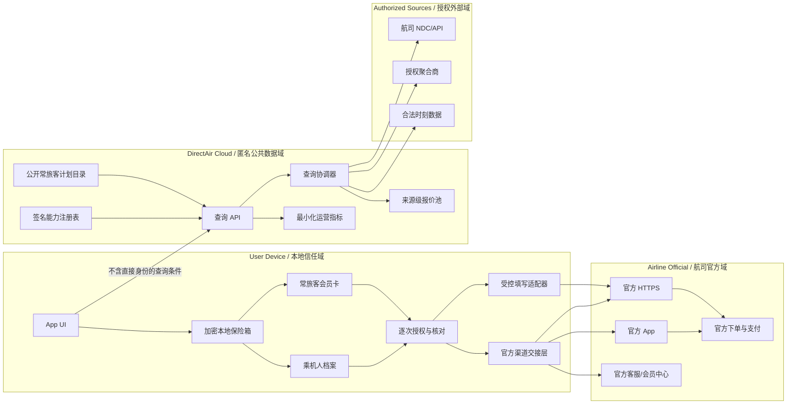

# DirectAir / 官网直通

## 隐私优先的航司官网查询、填单与常旅客卡管理平台

**文档类型：** 产品与技术架构基线  
**版本：** V2.0 Draft  
**更新日期：** 2026-08-24  
**状态：** 待数据源可行性验证  
**适用范围：** 中国大陆首发，后续再评估境外市场

---

## 0. 文档的使用方式

本文档是开发、安全、产品、商务和合规团队共用的架构基线，不是对航司接口能力的预设承诺。

文档中的外部能力必须使用以下状态：

| 状态 | 含义 | 是否允许进入生产 |
|---|---|---|
| `UNVERIFIED` | 仅为设想或待调研能力 | 否 |
| `DOCUMENTED` | 有官方文档，但未签约或未真机验证 | 否 |
| `SANDBOXED` | 已获得沙箱并通过基础集成测试 | 仅内测 |
| `CONTRACTED` | 已明确展示、缓存、转发和商业使用权限 | 待验收 |
| `PRODUCTION_VERIFIED` | 合同、安全、真机和回归测试均通过 | 是 |
| `SUSPENDED` | 页面、接口、合同或安全状态发生变化 | 否 |

任何人不得将示例 URL、示例 Schema 或原型代码解读为航司已经提供的真实能力。

---

## 1. 执行摘要

DirectAir 是一个“用户与航司官方渠道之间的工具层”，而不是另一个 OTA。

平台的价值来自四项能力：

1. **官网查询与来源透明：** 展示价格来源、获取时间、产品权益和可信状态。
2. **官方渠道交接：** 把用户带到已验证的航司 App、官网、在线客服或电话。
3. **本地乘机人保险箱：** 姓名、证件和联系方式默认仅在用户设备中加密保存。
4. **常旅客计划管理：** 统一管理航司会员卡、等级、手工里程和官方入口。

平台的默认交易边界：

- 不代收机票款；
- 不以平台名义出票；
- 不保存银行卡、支付凭证、短信验证码和航司密码；
- 不代用户确认运输条款或点击最终下单；
- 不承诺缓存报价可以成交；
- 不在未获授权时把网页批量抓取当作生产数据源。

---

## 2. 产品边界

### 2.1 本项目是什么

- 航班与报价查询助手；
- 航司官方渠道导航器；
- 本地乘机人与证件管理工具；
- 常旅客会员卡包；
- 用户明确授权后的受控填写助手；
- 退改签、行李、值机、里程补登和客服入口目录。

### 2.2 本项目默认不是什么

- 机票销售代理人；
- 票款结算方；
- 机票库存或价格权威源；
- 航司官方客服的替代品；
- 航司会员账户托管方；
- 自动处理验证码、风控、支付或最终下单的机器人。

### 2.3 能力级别

| 级别 | 能力 | 是否需要航司/数据商授权 |
|---|---|---|
| L0 | 官方网址、客服、会员中心目录 | 一般不需要，但需核验和品牌合规 |
| L1 | 本地乘机人和常旅客卡管理 | 不需要 |
| L2 | 航线/时刻查询和官网预填条件 | 取决于时刻数据与交接方式 |
| L3 | 公开匿名报价池 | 需要数据展示与缓存授权 |
| L4 | 点击前 reprice、定向交接 | 需要正式接口能力 |
| L5 | 官网逐字段受控填写 | 建议获得航司许可并逐版本验证 |
| L6 | 实时里程、等级和权益同步 | 需要 OAuth/API 或正式合作 |

MVP 只能承诺 L0-L1；L2 在数据和链接验证后开启；L3 以上必须通过能力闸门。

---

## 3. 不可变架构原则

1. **最小知情：** 后端不需要知道的用户信息，就不应有接收它的接口。
2. **默认本地：** 乘机人身份、常旅客账号和手工里程数据默认仅在设备内。
3. **显式交付：** 将数据填入航司页面前，必须展示接收航司、字段和目的。
4. **航司权威：** 价格、余位、退改、行李和里程以航司最终页面为准。
5. **来源优先：** 每个报价字段都必须能回答“来自哪里、什么时候获取”。
6. **失败可回退：** 深链、报价或填写失败时，始终回到官方 HTTPS 页面。
7. **关闭比猜测更快：** 页面或接口与已验证版本不符时，自动填写必须停用。
8. **合同先于缓存：** 技术上可缓存不代表合同允许缓存。
9. **不绕过保护：** 不绕过验证码、登录、限流、反自动化、区域或会员限制。
10. **未知即为不支持：** 任何未经证明的外部能力默认关闭。

---

## 4. 总体架构



### 4.1 两条数据链

#### A. 本地敏感数据链

包含：

- 乘机人姓名；
- 身份证、护照及有效期；
- 出生日期、性别、国籍；
- 手机号、电子邮箱；
- 常旅客会员号、等级和手工余额；
- 用户选择保存的证件图像。

它们不得进入 DirectAir 服务器、CDN 日志、崩溃报告、分析 SDK 或远程配置。

#### B. 匿名公共查询链

可包含：

- 出发地与目的地；
- 日期、舱等、人数类型；
- 直飞/中转筛选；
- 币种、销售地区和语言；
- 公开报价、获取时间和来源。

航线和出行日期在与 IP、账号或设备标识结合后仍可能反映个人出行意图，因此后端仍需日志最小化、短保留期和聚合统计。

---

## 5. 端侧隐私保险箱

### 5.1 存储模型

```text
OS Secure Storage
└── database_master_key
    ├── iOS: Keychain + ThisDeviceOnly + user presence
    └── Android: Keystore + hardware-backed key + user auth

Encrypted Local Database
├── passenger_profiles
├── identity_documents
├── frequent_flyer_memberships
├── local_balance_snapshots
└── consent_audit_local
```

规则：

- Keychain/Keystore 只保存数据库密钥或小型密钥材料，不存储整份乘机人档案。
- 数据库使用经审查的本地加密方案；不自创密码协议。
- 密钥应与设备绑定，默认不通过系统云备份迁移。
- 设备没有密码或生物识别时，应提示安全降级，必要时禁止保存证件图像。

### 5.2 敏感信息访问

- 添加、查看、导出、填写证件信息前触发用户验证；
- 证件号默认只显示后四位；
- 从后台返回 App 时重新遮挡敏感页面；
- 敏感页面不允许出现在系统任务缩略图中；
- 不自动把证件号写入剪贴板；
- 证件图像应为可选功能，并建议用户仅保存解析字段。

### 5.3 删除、导出与换机

默认行为：

- 卸载 App 即丢失本地档案；
- 换机不自动恢复；
- 不提供平台云同步。

可选的后续能力：

- 用户主动生成端到端加密导出包；
- 导出密码不上传；
- 导入前显示内容类型和记录数量；
- 导入完成后建议删除导出文件。

### 5.4 隐私承诺用语

允许：

> 乘机人姓名、证件、联系方式和常旅客账号默认仅在您的设备内加密保存，不上传 DirectAir 服务器。

禁止：

> 100% 不会泄露。  
> 整个 App 绝对零个人数据上云。

理由：网络请求仍会产生 IP 和运行元数据；任何软件也不应承诺永不发生安全事件。

---

## 6. 乘机人与证件数据模型

```json
{
  "schema_version": 1,
  "passenger_id": "local_uuid",
  "display_name": "张三",
  "name": {
    "family_name": "ZHANG",
    "given_name": "SAN",
    "native_name": "张三"
  },
  "date_of_birth": "1990-01-01",
  "gender": "X",
  "nationality": "CN",
  "contact": {
    "phone": "+86...",
    "email": "..."
  },
  "documents": [
    {
      "type": "PASSPORT",
      "number": "...",
      "issuing_country": "CN",
      "expires_at": "2032-01-01",
      "image_ref": null
    }
  ],
  "created_at": "local_time",
  "updated_at": "local_time"
}
```

设计要求：

- `passenger_id` 仅存在本地；
- 国际航班姓名拼写与本地姓名分开；
- 每名乘机人可有多个证件；
- 证件有效期只做本地提醒，不在后台生成用户旅行画像；
- 不默认把一个人的常旅客号应用给另一个人。

---

## 7. 常旅客计划与航司会员卡

### 7.1 模型原则

常旅客计划不应简化为“每家航司一张卡”：

- 多家航司可能共用一个集团计划；
- 一个计划可在联盟或合作伙伴航班上累积；
- 是否可累积取决于市场方、实际承运方、舱位、票价产品和计划规则；
- 会员价可能是个性化报价，不得进入公共报价缓存。

### 7.2 本地会员卡数据模型

```json
{
  "membership_id": "local_uuid",
  "passenger_id": "local_uuid",
  "program": {
    "program_code": "OFFICIAL_OR_INTERNAL_CODE",
    "program_name": "东方万里行",
    "primary_airline_codes": ["MU", "FM"],
    "alliance": "SKYTEAM"
  },
  "member_number": "...",
  "holder_name": "ZHANG/SAN",
  "tier": "GOLD",
  "tier_expires_at": "2027-12-31",
  "balance": {
    "value": 12000,
    "unit": "POINTS",
    "source": "USER_ENTERED",
    "updated_at": "2026-08-24T10:00:00+08:00"
  },
  "preferred_for_airlines": ["MU", "FM"],
  "official_links": {
    "account": "catalog_reference",
    "missing_miles": "catalog_reference",
    "support": "catalog_reference"
  }
}
```

### 7.3 会员卡能力分级

#### A. 第一版可离线完成

- 手工添加会员卡；
- 卡号掩码、本地复制；
- 记录等级和到期日；
- 手工记录里程和更新时间；
- 航班选择后提示“可能适用”的会员计划；
- 用户选择后填入 FQTV/会员号字段；
- 打开官方会员中心、客服、里程补登入口；
- 展示公开的计划规则来源与生效日期。

手工余额必须显示：

> 用户记录，更新于 YYYY-MM-DD，可能与航司账户不同。

#### B. 需要正式航司授权

- 实时里程余额；
- 实时等级与保级进度；
- 即将过期里程；
- 里程流水和未入账航段；
- 自动补登、转让、合并或兑换；
- 个性化会员价和卡券；
- 动态会员二维码或条码；
- 跨设备会员账户同步。

长期必须使用航司 OAuth/API 或正式账号授权。不保存航司密码、安全问题、短信验证码或长期 WebView Cookie；不抓取登录后的会员页面来模拟实时同步。

### 7.4 会员计划公共目录

云端可以管理不含用户身份的公开信息：

- 计划名称与运营方；
- 适用航司和联盟；
- 官方账户、补登和客服链接；
- 公开权益来源；
- 规则版本、生效日期和最后核验时间。

不得在未授权时使用航司卡面、标志或仿制官方电子会员卡。

---

## 8. 报价数据源闸门

报价平台开发前，每个数据源必须回答以下问题：

### 8.1 商务与合同

- 是否允许展示给终端用户？
- 是否允许缓存？最长多久？
- 是否允许跨用户复用公开报价？
- 是否要求品牌展示或来源标记？
- 是否允许比价和排序？
- 是否允许导向航司官网？
- 是否要求销售方、代理方或结算资质？
- 数据保留和删除期限是什么？

### 8.2 技术

- 是否有沙箱？
- 是否有 Shop/Search？
- 是否有 Reprice/Offer refresh？
- 是否有 Offer expiry？
- 是否有税费、行李、退改和舱位产品？
- 是否提供官方 handoff URL？
- 限流、超时、重试和月度配额是什么？
- 报价 ID 是否绑定销售地、币种、乘机人组合或会话？

### 8.3 数据质量

- 实际承运方和市场方是否区分？
- 全包价是否包含税费？
- 行李和退改规则是结构化还是文本？
- 余座是真实值、阈值还是未知？
- 飞机型号、准点率和里程累积来自同一源还是其他数据源？

### 8.4 Go / No-Go

只有当一个数据源同时满足以下条件，才能进入共享报价池开发：

- 获得可用沙箱；
- 展示与缓存权限已书面确认；
- 数据字段和可空性已建模；
- 生产限流与费用可接受；
- 至少完成 100 组沙箱或受控用例测试；
- 已定义失效、价格变化和无票的用户体验。

---

## 9. 公共报价池

### 9.1 报价类型

| 类型 | 是否共享 | 说明 |
|---|---|---|
| `PUBLIC_ANONYMOUS` | 可，前提是合同允许 | 非登录公开价 |
| `PUBLIC_CONDITIONAL` | 有条件可 | 按人数、市场、币种、舱等隔离 |
| `MEMBER` | 否 | 会员登录价 |
| `CORPORATE` | 否 | 企业协议价 |
| `COUPON` | 否 | 卡券或用户特定优惠 |
| `PERSONALIZED` | 否 | 与个人或会话绑定 |

### 9.2 Canonical Query

不直接拼接字符串；使用版本化、稳定序列化的结构。

```json
{
  "schema_version": 2,
  "source_id": "MU_NDC",
  "point_of_sale": "CN",
  "currency": "CNY",
  "locale": "zh-CN",
  "journeys": [
    {
      "origin": "PEK",
      "destination": "SHA",
      "departure_date": "2026-10-01"
    }
  ],
  "passengers": {
    "adults": 1,
    "children": 0,
    "infants": 0
  },
  "cabin": "ECONOMY",
  "direct_only": true,
  "included_carriers": [],
  "excluded_carriers": [],
  "fare_scope": "PUBLIC_ANONYMOUS"
}
```

缓存键：

```text
quote:v2:{source_id}:{sha256(canonical_json)}
```

缓存值中保存 `canonical_query_digest` 和必要的规范化字段，用于审计和防止错误复用。缓存键不得包含姓名、会员号、证件号、邮箱、手机号或稳定设备标识。

### 9.3 报价 Schema

```json
{
  "snapshot_id": "opaque_id",
  "source": {
    "id": "MU_NDC",
    "class": "OFFICIAL_API",
    "capability_version": "2026-08",
    "attribution": "..."
  },
  "query_digest": "sha256...",
  "observed_at": "2026-08-24T12:00:00Z",
  "soft_expires_at": "2026-08-24T12:03:00Z",
  "hard_expires_at": "2026-08-24T12:10:00Z",
  "source_offer_expires_at": null,
  "status": "FRESH",
  "offers": [
    {
      "offer_handle": "server_opaque_handle",
      "offer_type": "PUBLIC_ANONYMOUS",
      "itinerary": {
        "segments": [
          {
            "marketing_carrier": "MU",
            "operating_carrier": "MU",
            "flight_number": "5101",
            "origin": "PEK",
            "destination": "SHA",
            "departure_at": "2026-10-01T08:00:00+08:00",
            "arrival_at": "2026-10-01T10:15:00+08:00",
            "aircraft": {
              "value": null,
              "source": null,
              "observed_at": null
            }
          }
        ]
      },
      "price": {
        "total": "670.00",
        "currency": "CNY",
        "tax_included": true,
        "source": "MU_NDC",
        "observed_at": "2026-08-24T12:00:00Z"
      },
      "fare": {
        "cabin": "ECONOMY",
        "booking_class": "V",
        "brand": null,
        "baggage": null,
        "change_rules": null,
        "refund_rules": null,
        "mileage_accrual": null
      },
      "availability": {
        "state": "AVAILABLE",
        "seats_left": null
      },
      "capabilities": {
        "reprice": true,
        "official_handoff": false
      }
    }
  ]
}
```

规则：

- 金额使用十进制字符串或 Decimal，不使用二进制浮点数；
- 未知字段必须为 `null`，不允许猜测；
- 准点率、飞机型号、余座和里程可来自不同数据源，必须按字段记录来源；
- 不将上游报价 ID 直接暴露给客户端；
- `offer_handle` 是短期、不可枚举的服务器代理标识；
- 上游凭证、会话和重新定价令牌不下发客户端。

### 9.4 Double-TTL 状态机

```text
FRESH
  now < soft_expires_at
  -> 立即返回

STALE_REFRESHING
  soft_expires_at <= now < hard_expires_at
  -> 立即返回“最近观察价”
  -> 只允许一个刷新任务

EXPIRED
  now >= hard_expires_at
  -> 在有限等待时间内请求上游
  -> 超时则返回官网查询入口，不伪装成实时价

FAILED_STALE
  刷新失败且合同允许 stale-if-error
  -> 可显示旧值、明确年龄和失败状态

UNAVAILABLE
  数据源无可用报价
  -> 使用短 TTL，不与系统错误混淆
```

“软过期”只表示“可以立即展示的最近观察值”，不表示可成交。

### 9.5 TTL 计算

最终硬过期不得超过以下任一边界：

```text
hard_ttl = min(
  contract_cache_limit,
  source_offer_expiry - safety_margin,
  system_policy_limit
)
```

如果数据源不允许缓存，`hard_ttl = 0`。

在合同未规定更严上限时，可使用以下起始策略：

| 距离起飞 | 软 TTL | 系统硬 TTL 上限 |
|---|---:|---:|
| 30 天以上 | 10 分钟 | 30 分钟 |
| 7-30 天 | 5 分钟 | 15 分钟 |
| 1-7 天 | 2 分钟 | 5 分钟 |
| 6-24 小时 | 60 秒 | 2 分钟 |
| 6 小时内 | 30 秒 | 60 秒 |

动态调整：

- 连续 5 次价格与余位状态均未变：软 TTL 最多乘 1.5；
- 最近 3 次中变化 2 次以上：软 TTL 减半；
- 最短 30 秒；
- 不得超过合同、Offer 到期或系统上限；
- 加入 ±15% 抖动，防止批量缓存同时刷新。

### 9.6 Singleflight 与并发保护

- 同一 `source_id + canonical_query` 在同一时刻只有一个上游查询；
- 其他请求共享结果或受控等待；
- 单进程可使用语言内 Singleflight；
- 多实例使用带超时的分布式刷新租约；
- 分布式锁只用于减少重复查询，不得被当作业务正确性保证；
- 上游请求必须幂等或可安全重试；
- 刷新任务必须有超时、限流、指数退避和熔断。

### 9.7 热门与冷门查询

- 热门键：在软过期前后由访问触发或有配额时预刷新；
- 冷门键：按需查询，不定时预热；
- 热度只保存聚合计数，不保存用户级查询历史；
- 预刷新不得超过上游配额和合同允许范围。

### 9.8 点击前复核

当用户点击“前往官网购买”：

1. 数据源支持 reprice：调用复核，显示价格变化；
2. 数据源不支持 reprice：显示报价获取时间并直接进入官网重新查询；
3. 报价已硬过期：不显示“已验价”；
4. 航司官网支付页价格始终是最终权威价格。

---

## 10. 航司交接层

### 10.1 交接优先级

1. 经验证的航司官方 HTTPS 链接；
2. 经航司关联验证的 Universal Link / Android App Link；
3. 经真机验证的 Custom URL Scheme；
4. 官方 App 首页；
5. 航司官网首页或查询页；
6. 经单航司验证的受控填写适配器。

不得将未经证的 Custom Scheme 写死为生产能力。

### 10.2 Capability Registry

```json
{
  "airline_code": "MU",
  "capability_id": "mu_booking_handoff_ios",
  "type": "OFFICIAL_HTTPS",
  "status": "PRODUCTION_VERIFIED",
  "platform": "IOS",
  "target": "https://official.example/verified-path",
  "supported_params": ["origin", "destination", "departure_date"],
  "allowed_hosts": ["official.example"],
  "min_app_version": null,
  "max_tested_app_version": null,
  "evidence": {
    "type": "OFFICIAL_DOCUMENT_OR_TEST_RECORD",
    "reference": "internal_record_id"
  },
  "verified_at": "2026-08-24T00:00:00Z",
  "expires_at": "2026-11-24T00:00:00Z",
  "fallback_capability_id": "mu_official_homepage"
}
```

安全规则：

- 客户端内置官方域名根白名单；
- 远程注册表必须签名、版本化并支持紧急停用；
- 远程配置不得绕过客户端域名白名单；
- 链接失败时显示官方域名与备用入口；
- 链接过期后自动降级，不继续声称支持定向跳转。

### 10.3 客服与会员入口

每家航司可维护：

- 境内/境外官方电话；
- 服务时间与语言；
- 官方在线客服；
- 退票、改期、行李、值机和不正常航班入口；
- 常旅客账户、里程补登和等级规则入口。

每条记录必须有官方来源、核验日期和下次复核日期。

---

## 11. 受控官网填写

### 11.1 定位

受控填写是可选增强能力，不是核心主链路。页面变化、合规状态不明或安全检查失败时，立即降级为官方页面和用户手工输入。

### 11.2 禁止设计

禁止：

- 把完整乘机人对象挂到 `window` 或网页全局作用域；
- 通过模糊 `placeholder` 选择器猜测证件字段；
- 向 iframe 或未知子资源填写；
- 处理航司密码、短信码、图形验证码和支付数据；
- 自动勾选运输条款；
- 自动点击最终下单、支付或发送按钮；
- 忽略证书错误、降级 HTTPS 或启用任意网络加载；
- 在调试、崩溃报告或埋点中捕获字段值。

### 11.3 每次填写流程

```text
1. 校验 HTTPS + 精确域名 + 主页面路径
2. 校验适配器版本与页面指纹
3. 用户选择乘机人/会员卡
4. 显示航司、字段和用途
5. 用户生物识别或本地验证
6. 逐字段解密、填写、释放临时值
7. 用户在航司页面核对
8. 用户亲自提交、验证和支付
```

### 11.4 适配器规范

每个适配器必须包含：

- 航司代码；
- 官方域名与精确路径；
- 页面指纹；
- 支持字段；
- 精确元素规则；
- 输入事件规则；
- 已测航司网页版本；
- 已测 App/OS 版本；
- 安全审查记录；
- 回归测试；
- 紧急停用开关；
- 验证到期日期。

受控填写只有在航司、页面和版本级别的回归测试通过时才能开启。

---

## 12. 后端 API

后端不提供任何乘机人、证件、手机号或常旅客号上传接口。

### 12.1 创建查询

```http
POST /api/v2/searches
Content-Type: application/json
```

```json
{
  "point_of_sale": "CN",
  "currency": "CNY",
  "locale": "zh-CN",
  "journeys": [
    {
      "origin": "PEK",
      "destination": "SHA",
      "departure_date": "2026-10-01"
    }
  ],
  "passengers": {
    "adults": 1,
    "children": 0,
    "infants": 0
  },
  "cabin": "ECONOMY",
  "direct_only": true
}
```

响应：

```json
{
  "search_id": "short_lived_opaque_id",
  "quote_status": "FRESH",
  "observed_at": "2026-08-24T12:00:00Z",
  "source_summary": ["OFFICIAL_API"],
  "offers": [],
  "fallbacks": [
    {
      "airline_code": "MU",
      "action": "OPEN_OFFICIAL_SEARCH"
    }
  ]
}
```

### 12.2 报价复核

```http
POST /api/v2/offers/{offer_handle}/recheck
```

- `offer_handle` 必须短期有效、不可枚举、不暴露上游令牌；
- 不支持 reprice 的数据源返回 `RECHECK_UNSUPPORTED`；
- 价格变化时返回新价与变化时间；
- 不以该接口创建 PNR 或订单。

### 12.3 获取官方交接能力

```http
GET /api/v2/airlines/{airline_code}/handoff?platform=ios&intent=booking
```

只返回已验证或安全回退能力，不返回 `UNVERIFIED` 目标。

### 12.4 常旅客公开目录

```http
GET /api/v2/loyalty-programs
GET /api/v2/loyalty-programs/{program_code}
```

只包含公开计划信息和官方入口；不接受会员号、余额、姓名或登录凭证。

### 12.5 API 强制规则

- 使用严格 Schema，默认拒绝未知字段；
- CI 中加入敏感字段负向测试；
- 请求日志不记录完整请求体；
- 禁止将查询参数写入长期分析事件；
- `search_id` 和 `offer_handle` 短期过期；
- 不使用稳定帐号标识来构建公共报价缓存。

---

## 13. 安全与威胁模型

### 13.1 主要威胁

| 威胁 | 影响 | 主要缓解 |
|---|---|---|
| 手机丢失或被借用 | 证件与卡号泄露 | 设备密码、用户在场验证、掩码 |
| 系统备份泊送 | 敏感库进入云备份 | ThisDeviceOnly、排除备份、默认无迁移 |
| 第三方 SDK | 日志、页面或输入值外传 | 敏感页无埋点、SDK 白名单、供应链审查 |
| 恶意或受损航司页面 | 读取已填入 DOM 的数据 | 逐次授权、精确域名、逐字段填写、用户核对 |
| 错误适配器 | 字段填错导致无法出行 | 页面指纹、精确选择器、回归测试、熔断 |
| 伪造远程配置 | 跳转钓鱼站或恶意填写 | 签名注册表、客户端根白名单 |
| 缓存串价 | 展示错误市场/人数/会员价 | 完整 Canonical Query、报价分类、价格复核 |
| 上游服务失效 | 大量超时与重试风暴 | 超时、退避、限流、熔断、官网回退 |
| 上游令牌泄露 | 账单或数据访问风险 | 服务器保密、不下发原始令牌、定期轮换 |

### 13.2 红线

- 生产日志中出现证件号、会员号、手机号或乘机人姓名，视为安全事件；
- 航司域名不在本地白名单中，禁止解密和填写；
- 页面指纹不匹配，禁止填写；
- 没有明确缓存授权的数据源，禁止进入共享报价池；
- 个性化和会员报价禁止跨用户复用；
- 不允许通过客户端分布式抓取来规避上游访问限制。

---

## 14. 隐私与数据治理

### 14.1 用户端

- 首次启动显示简明隐私说明；
- 在添加证件、证件照片和常旅客卡时分别说明目的；
- 拒绝保存证件不影响官方导航和航班查询；
- 用户可随时查看、更正、删除本地记录；
- 填写前显示接收航司、信息种类和用途；
- 国际航司或境外页面填写时，额外显示境外接收提示。

### 14.2 云端

- 不绑定账号保存完整出行查询历史；
- 网关日志不保存完整 URL Query 或请求体；
- IP 保留期以安全防护所需最短时间为准；
- 热度只保存“规范化查询键 + 时间窗计数”；
- 原始上游响应不长期存档，除非合同与故障调查明确需要；
- 保留期必须记录在数据目录中，不使用“无限期”。

### 14.3 第三方 SDK

默认不引入广告 SDK。每个分析、崩溃或推送 SDK 必须有：

- 收集字段清单；
- 处理目的；
- 保留期；
- 数据地域；
- 敏感页排除配置；
- 替代方案评估；
- 下线和删除计划。

---

## 15. 可观测性与 SLO

### 15.1 不含个人信息的核心指标

- 报价缓存命中率；
- 软过期展示率；
- 硬过期等待超时率；
- Singleflight 合并比；
- 每数据源 QPS、错误率、限流率和延迟；
- 价格复核变化率；
- 报价过期/无可用率；
- 深链成功率与回退率；
- 受控填写适配器失配和熔断率；
- 官方目录过期记录数；
- App 无崩溃会话率。

### 15.2 起始 SLO

| 项目 | MVP 目标 |
|---|---:|
| 缓存命中查询 p95 | < 500 ms |
| 未命中查询 | 渐进显示，10 s 内返回结果或官网回退 |
| 报价来源和时间覆盖 | 100% |
| 生产后端敏感字段接收接口 | 0 |
| 已启用深链存在验证证据 | 100% |
| 已启用填写适配器回归测试 | 100% |
| App 无崩溃会话率 | >= 99.5% |

SLO 是运营目标，不是对报价或航司系统可用性的承诺。

### 15.3 告警

- 某数据源 5 分钟错误率超阈值：熔断并降级；
- 价格复核变化率异常上升：缩短 TTL 并检查缓存键；
- 深链失败率异常：标记 `SUSPENDED`；
- 页面指纹失配：立即停用适配器；
- 日志 DLP 检测到敏感字段：按安全事件处理；
- 某官方客服或会员链接过期：下线直达能力，保留官网首页。

---

## 16. 基础设施与容量

### 16.1 技术选型原则

不在数据源闸门通过前过早锁定生产容量。

可用起点：

| 层 | 选择 | 备注 |
|---|---|---|
| 客户端 | Flutter + 必要原生安全模块，或纯原生 | 敏感存储和 WebView 必须做原生审查 |
| 查询服务 | Go 或类型安全的 Node.js | 以团队能力和运维经验决定 |
| 短期缓存 | Redis 或等价管理服务 | 开发环境可单实例，生产需备份/高可用计划 |
| 公开目录 | PostgreSQL/SQLite 起步 | 仅公开规则、能力证据和聚合指标 |
| 队列 | 按需引入 | MVP 可用进程内任务，多实例再引入持久队列 |

### 16.2 容量模型

容量不使用“单机轻松支撑数十万查询”等无证据表述。至少计算：

```text
peak_qps
× cache_miss_rate
× average_sources_per_search
= upstream_qps

cache_entries
× average_snapshot_size
× replication_factor
= memory_requirement

monthly_cost =
  infrastructure
  + upstream_api
  + bandwidth
  + observability
  + security_testing
  + app_store_accounts_and_fees
  + operations_and_support
```

实际最大成本可能是数据授权和航司适配维护，而不是云服务器。

### 16.3 生产基线

- 开发/测试/生产隔离；
- 密钥和上游凭证使用专用保密管理；
- 数据源级限流、超时和熔断；
- 远程能力注册表签名；
- 缓存不作为唯一持久真相；
- 无单个实例失效导致无法返回官网回退链接；
- 日志、指标和故障追踪不包含敏感值。

### 16.4 部署形态：先模块化单体，后按故障域拆分

V2 首期后端采用模块化单体：

```text
DirectAir API Service
├── search-api
├── query-normalizer
├── quote-orchestrator
├── source-connectors
├── cache-policy
├── handoff-registry
├── loyalty-program-catalog
└── privacy-safe-telemetry
```

模块之间使用明确接口，但可以在同一进程和同一部署单元中运行。只有在以下情况被真实运营数据证明后才拆分服务：

- 不同数据源需要独立扩缩容；
- 某连接器故障需要与其他来源隔离；
- 发布节奏或合规边界明显不同；
- 单体已经成为可测量的可用性或团队协作瓶颈。

不以“未来可能有数十万用户”作为提前拆微服务的理由。

---

## 17. 商业化

### 17.1 交易分离

- 机票价格、下单和支付完全在航司渠道内；
- DirectAir 不接收机票款；
- 没有航司回调时，DirectAir 不声称知道用户已成功出票；
- 不将导流成功描述成出票成功。

### 17.2 可选支持

MVP 建议免费，先验证用户需求。

后续若提供“支持开发者”：

- iOS 使用应用内购买的可选打赏能力；
- Android 根据 Google Play 和实际分发渠道规则分别实现；
- 支持行为不解锁功能、不提高查询优先级；
- 不使用“公益捐赠”用语，除非具备相应资质；
- 不在无出票回调时以“出票成功”为触发条件；
- 财务透明报告可按月发布，不暴露个别付款记录。

### 17.3 可选长期收入

在不改变工具定位的前提下，可评估：

- 开源社区赞助；
- 对企业差旅团队提供的本地隐私管理工具；
- 不影响排序的明示合作费；
- 航司官方接入和安全适配服务；
- 可选付费的端到端加密迁移功能，前提是不破坏本地优先原则。

---

## 18. 分阶段实施路线

### Phase 0：可行性闸门（3-6 周）

产出：

- 数据源候选清单；
- 至少一个真实沙箱；
- 展示、缓存和导流条款记录；
- 首批航司官方链接证据库；
- 端侧威胁模型；
- 应用商店商业化备忘录；
- Go/No-Go 决策。

**Go 条件：**

- 本地保险箱与官方目录可独立实现；
- 不需要未授权抓取即可产生 MVP 用户价值；
- 已明确不把未验证深链写入生产。

### Phase 1：本地隐私 MVP（6-10 周）

范围：

- 乘机人本地保险箱；
- 多证件管理；
- 常旅客卡包；
- 会员等级与手工里程记录；
- 官方网站、App、客服、会员中心和补登入口；
- 本地加密、删除和可选导出；
- 不做通用 WebView 注入；
- 不承诺跨航司实时价格。

**验收：**

- 后端 API Schema 无乘机人敏感字段；
- 离线状态可完成资料和会员卡管理；
- 本地数据在设备无授权状态下不可读；
- 删除后无法通过正常 App 路径恢复；
- 官方链接皆有来源和核验日期。

### Phase 2：单一授权报价源（获得资格后 8-12 周）

范围：

- 一家航司或一家授权聚合商；
- Canonical Query；
- Double-TTL 与 Singleflight；
- 数据源级限流、超时和熔断；
- 来源、获取时间和报价状态展示；
- 只在上游支持时做 reprice；
- 官网回退。

**验收：**

- 缓存规则不超过合同上限；
- 会员/企业/优惠券价不进入公共缓存；
- 100% 报价显示来源和时间；
- 无票、限流、超时和价格变化已测试；
- 大量同键并发只产生受控数量的上游请求。

### Phase 3：受控交接与填写（4-8 周）

范围：

- 一家合作或明确允许的航司；
- 一个官方页面流程；
- 用户逐次确认；
- 逐字段填写；
- 页面指纹与紧急熔断；
- 真机回归测试；
- 移动端安全测试和商店预审。

**验收：**

- 域名、路径或页面指纹变化后自动停用；
- 不向全局 JS 上下文暴露完整档案；
- 不填写 iframe、密码、验证码和支付字段；
- 不自动提交；
- 安全测试无高危未修复问题。

### Phase 4：逐航司扩展

- 每家航司独立合同、数据源、TTL 和适配器；
- 热门查询预热和动态 TTL；
- 多实例与高可用缓存；
- 定期安全审查；
- 获得授权后增加实时里程与会员权益同步；
- 始终保留官方链接回退。

---

## 19. 测试策略

### 19.1 端侧

- 加密库与密钥生命周期；
- 生物识别失败和降级；
- 应用进入后台的页面遮挡；
- 卸载、重装、备份和换机；
- 证件到期提醒；
- 多乘机人与多常旅客卡的归属；
- 未授权时无法读取敏感值；
- 敏感值不出现在日志、剪贴板和截图中。

### 19.2 报价平台

- Canonical Query 稳定序列化；
- 人数、币种、销售地和报价类型隔离；
- Fresh / Stale / Expired / Failed / Unavailable 状态转移；
- Singleflight 高并发；
- 锁超时和重复刷新；
- 上游限流、超时和熔断；
- 无票与上游错误区分；
- 报价过期和价格变化；
- 缓存 TTL 不超过合同上限；
- 个性化价不进入公共池。

### 19.3 交接与适配器

- 深链未安装、版本不支持和路径失效；
- 官方 HTTPS 回退；
- 远程配置签名失败；
- 域名白名单绕过尝试；
- 页面指纹变化；
- 类似字段误填；
- iframe 和外域跳转；
- 适配器远程紧急停用；
- 用户取消授权。

### 19.4 安全

- 本地数据库提取测试；
- 密钥迁移和备份测试；
- 调试/日志/崩溃报告泄露；
- 恶意网页脚本读取测试；
- 远程注册表伪造；
- 上游令牌泄露；
- 服务器 API 敏感字段拒绝；
- 第三方 SDK 行为审查；
- 移动端渗透测试。

---

## 20. 发布闸门

### 20.1 客户端发布

- [ ] 本地保险箱威胁模型通过审查
- [ ] 加密密钥不可导出且不进入云迁移
- [ ] 敏感页无第三方埋点
- [ ] 本地删除、导出和换机行为已告知
- [ ] 官方链接具有来源、核验日期和回退
- [ ] 常旅客余额明确标记手工记录或官方来源
- [ ] 不存储航司密码和验证码
- [ ] 应用商店隐私标签与实际行为一致

### 20.2 报价数据源发布

- [ ] 生产合同允许展示和缓存
- [ ] 缓存上限已进入源级配置
- [ ] 所有报价字段有来源和时间
- [ ] 公开与个性化报价已隔离
- [ ] reprice 只对支持的源开启
- [ ] 限流、超时、熔断和回退已验证
- [ ] 数据源停用不会阻止官网导航

### 20.3 填写适配器发布

- [ ] 航司、域名、路径和版本已验证
- [ ] 有明确启用依据或合作记录
- [ ] 页面指纹与回归测试通过
- [ ] 不向网页全局作用域暴露完整档案
- [ ] 不填写密码、验证码和支付字段
- [ ] 用户完成最终确认和提交
- [ ] 有紧急停用开关和官网回退

---

## 21. 主要风险登记表

| 风险 | 概率 | 影响 | 应对 |
|---|---|---|---|
| 无法获得可共享缓存的官方价格源 | 高 | 高 | 官网导航型 MVP，并行商务接入 |
| 航司无稳定定向链接 | 高 | 中 | 官网首页回退、复制查询条件 |
| WebView 支付或登录不兼容 | 高 | 高 | 系统浏览器/官方 App 优先 |
| 自动填写页面频繁失效 | 高 | 中 | 单航司适配、指纹、熔断 |
| 报价与官网价发生变化 | 高 | 中 | 时间标记、动态 TTL、reprice、官网为准 |
| 应用商店拒绝外部打赏 | 中 | 中 | 先免费，后续使用官方应用内购买 |
| 本地无云备份导致用户丢数据 | 高 | 中 | 明确告知、可选加密导出 |
| 第三方 SDK 泄露敏感信息 | 中 | 高 | 敏感页无 SDK、供应链审查 |
| 会员规则频繁变更 | 高 | 中 | 版本化来源、生效日和定期复核 |
| 品牌/卡面/“官方”标识争议 | 中 | 中 | 文字导航优先，授权后再使用品牌素材 |

---

## 22. 需要建立的 ADR

在实施阶段建立以下架构决策记录：

1. ADR-001：本地加密数据库和密钥存储方案；
2. ADR-002：无云备份与加密导出取舍；
3. ADR-003：首个报价数据源与合同约束；
4. ADR-004：Canonical Query 和公共报价范围；
5. ADR-005：Double-TTL 与故障时 stale 策略；
6. ADR-006：航司交接能力注册表与签名机制；
7. ADR-007：第一个受控填写适配器的安全边界；
8. ADR-008：常旅客卡包与官方同步边界；
9. ADR-009：应用商店支持/打赏方案；
10. ADR-010：日志、指标与数据保留政策。

---

## 23. 成功标准

项目的成功不是“航司覆盖数量”或“每日查询量”本身，而是：

- 用户可以不把证件档案上传平台服务器；
- 用户可以统一管理多个乘机人和多个常旅客计划；
- 用户清楚知道报价来源、时间和最终确认位置；
- 平台在外部能力失效时仍能安全退回航司官网和客服；
- 任何个性化报价或会员账号数据都不被误放入公共池；
- 数据源、深链和填写能力都有可追溯证据与停用机制；
- 商业化不改变排序公平性，不将用户重新锁回新的中介体系。

---

## 24. 立即执行的下一步

1. 建立《数据源候选与合同问卷》；
2. 建立首批航司《官方入口与真机验证矩阵》；
3. 完成 ADR-001，决定本地加密库与密钥策略；
4. 完成 ADR-008，冻结常旅客卡 MVP 边界；
5. 用离线原型验证“乘机人 + 常旅客卡 + 官方入口”的用户价值；
6. 数据源闸门未通过前，不开发生产共享报价池；
7. 航司页面许可与安全模型未确认前，不开发通用 WebView 自动填写。

---

## 附录 A：用户界面中的报价状态用语

| 系统状态 | 用户文案 |
|---|---|
| `FRESH` | “获取于 1 分钟前” |
| `STALE_REFRESHING` | “最近报价，正在更新” |
| `EXPIRED` | “报价已过期，请重新查询” |
| `FAILED_STALE` | “暂时无法更新，显示 X 分钟前的参考价” |
| `UNAVAILABLE` | “数据源暂无可用报价，可前往官网查询” |
| `REPRICE_CHANGED` | “航司最新报价已变更” |

禁止在报价未被航司支付页确认时使用“保证价”、“必然有票”或“官网锁价”。

## 附录 B：开发团队必须拒绝的变更

- 新增乘机人资料云备份，但没有新的隐私、威胁和密钥设计；
- 为了提高转化率自动点击航司最终提交；
- 为了省事把完整乘机人对象挂到网页 JavaScript 全局作用域；
- 为了提高命中率忽略币种、人数、销售地或会员属性；
- 为了快速接航司而使用未验证深链或隐藏接口；
- 为了规避后端限制而组织用户客户端分布式抓取；
- 为了方便排查问题在日志中保存请求体、证件、会员号或上游凭证；
- 为了商业化将支付与查询排名、用户隐私或基础功能绑定。

## 附录 C：官方依据索引

以下资料用于支持架构边界和后续 ADR，不代替针对实际产品流程的专业法律意见：

1. [中国民航局《公共航空运输旅客服务管理规定》](https://www.caac.gov.cn/XXGK/XXGK/MHGZ/202103/t20210315_206814.html)
2. [《中华人民共和国个人信息保护法》](https://www.cac.gov.cn/2021-08/20/c_1631050028355286.htm)
3. [市场监管总局《网络反不正当竞争暂行规定》](https://www.samr.gov.cn/zw/zfxxgk/fdzdgknr/fgs/art/2024/art_80019fe59e464196bef173dc56678a42.html)
4. [IATA NDC / Offer and Order 介绍](https://www.iata.org/en/iata-repository/pressroom/fact-sheets/fact-sheet-ndc/)
5. [东航 NDC 开放平台](https://developer.ceair.com/)
6. [IATA FQTV / LoyaltyProgramAccount 实现指南](https://guides.developer.iata.org/docs/21-2_ImplementationGuide.pdf)
7. [Apple：Restricting Keychain Item Accessibility](https://developer.apple.com/documentation/security/restricting-keychain-item-accessibility)
8. [Apple：WKWebView 深度交互与 App-Bound Domains](https://developer.apple.com/videos/play/wwdc2021/10032/)
9. [Apple App Review Guidelines](https://developer.apple.com/app-store/review/guidelines/)
10. [Google Play Payments Policy](https://support.google.com/googleplay/android-developer/answer/9858738)
11. [RFC 9111: HTTP Caching](https://www.rfc-editor.org/rfc/rfc9111.html)

在某条航司链接、会员规则或数据接口进入 `PRODUCTION_VERIFIED` 之前，还必须保存该能力自身的官方证据、版本、验证日期和合同限制；本附录不能代替单航司能力证据。
